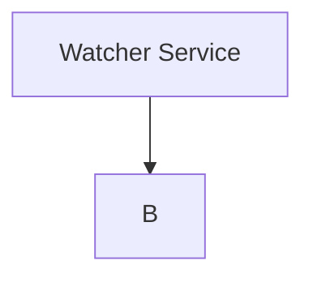

# Overview

This is an event driven project that focuses on being even driven. I have broken up a lot of functionality for the sake
of getting practice creating a reading messages in kafka.

## Approach

My design goal is to separate each distinct step into a different service and connect those appropriately.

